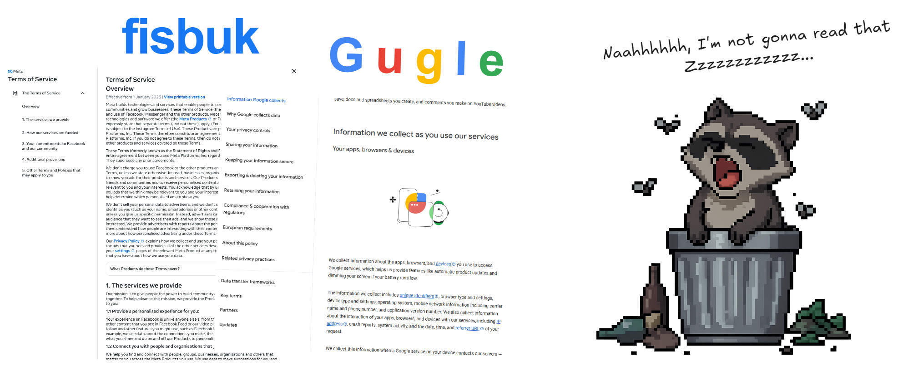

#  Policy TL;DR (Too Long; Didn't Read) 

### What is this?

Policy TL;DR is a browser extension that skims the fine print for you and serves a short, human‑readable summary of privacy policies — so you can get on with your day.

### How it works (in short)

- Detects privacy policy links on the current page
- Sends the content to an AI model to summarize
- Shows a quick summary and a simple privacy score

### Get the extension

- Available on the Chrome Web Store: [link coming soon]
- Note: This GitHub repository is for suggestions, issues, and roadmap discussion. The extension itself is installed via the store.

### Feedback and suggestions

Got ideas, found a policy we should handle better, or noticed a bug? Please open an Issue in this repo. Short repro steps or example URLs help a lot.

### Developer docs

For contributors: see the developer guide with architecture and file map in `docs/README.md`.
Also see `docs/PRIVACY.md` and `docs/SECURITY.md`.

