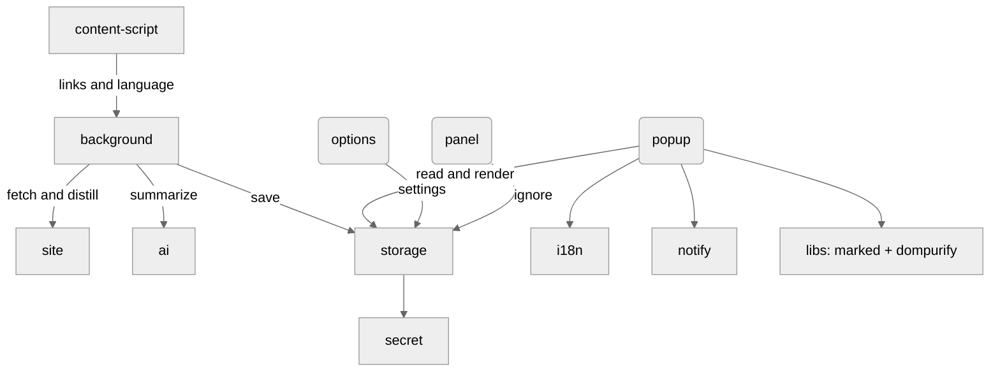
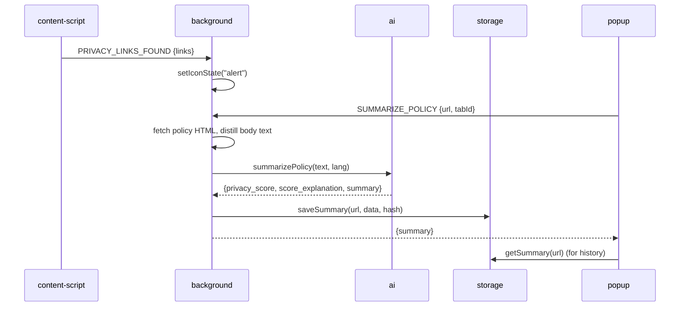

# Developer Guide — Policy TL;DR

This guide maps the code in `src/`, shows how pieces interact, and highlights where to contribute.

## Architecture overview (simplified)

## Source map (what lives where)

- `ai.js`: Builds provider requests (xAI default, OpenAI optional), enforces strict JSON, parses loosely structured outputs defensively, applies timeouts. Export: `summarizePolicy(text, lang, options)`.
- `background.js`: Background router. Detects privacy or terms pages, fetches and distills policy text, avoids re-summarizing identical content via hashing, manages icon or badge, context menu, and message passing.
- `content-script.js`: Runs on pages. Reports language, scans for policy links via `window.findPrivacyLinks`, watches DOM mutations for SPAs.
- `detector.js`: Heuristics to find privacy policy links in anchors and plain text. Exposed on `window.findPrivacyLinks` for non-module contexts.
- `popup.js`: Main UI. Tabs (Summary and History), summarizes current page, renders Markdown using `libs/marked.js` and sanitizes with `libs/dompurify.js`, shows notifications, manages history.
- `options.js`: Settings UI for API key, language, and AI model configuration. Validates inputs and persists with `storage.js`.
- `panel.js`: Side panel to dismiss alerts and ignore domains quickly.
- `storage.js`: Persistence. Secures API key (AES-GCM), stores summaries with content hashes, user preferences, ignored domains.
- `secret.js`: Secret generation and migration for encryption key derivation.
- `notify.js`: Small alert or confirm helpers for UI.
- `i18n.js`: Attribute-based translation utility with en, es, fr, pt, de, it.
- `styles.css`: Global styles and design tokens for the extension.
- `libs/` (vendored): `dompurify.js` (sanitization) and `marked.js` (Markdown). Replace files to update; do not modify.

## Message flow

